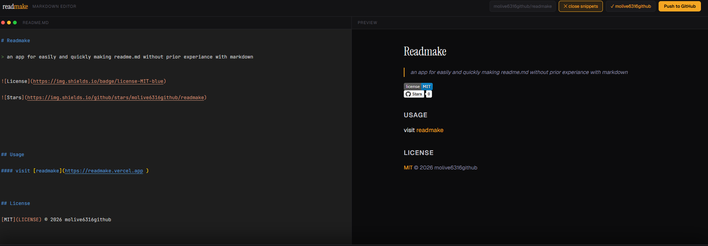

# Readmake

> an app for easily and quickly making readme.md without prior experiance with markdown

 

## Usage

#### visit [readmake](https://readmake.vercel.app ), connect your repo, use the snippets to your hearts desire, and push to github. 
## Screenshot

## FAQ

**Q: Does it support gitlab?**
A: No, we currently only support github or downloadaing as an md.

## License

[MIT](LICENSE) © 2026 molive6316github

